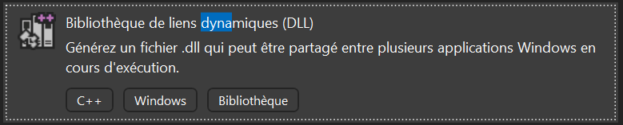
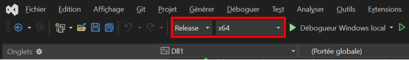
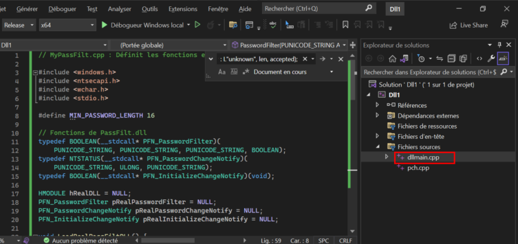
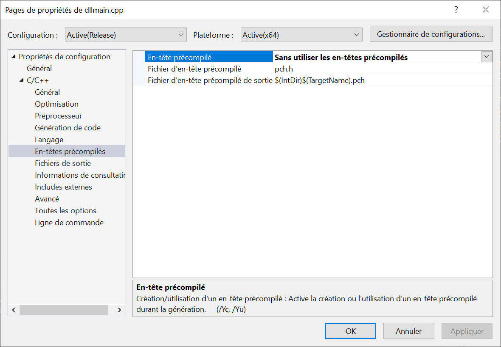
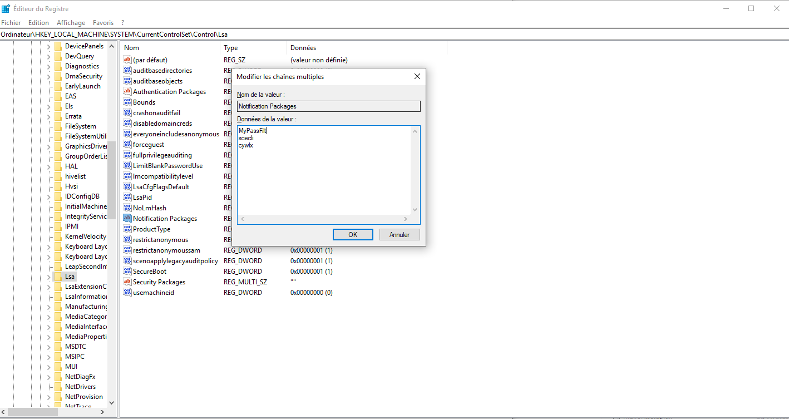

# Renforcement des mots de passe Windows avec une DLL personnalisée

## Contexte

Sur les systèmes Windows, la sécurité des mots de passe repose en grande partie sur un composant système appelé **LSASS** (*Local Security Authority Subsystem Service*). Ce service critique se charge de l’authentification des utilisateurs, de l’application des stratégies de sécurité et de la gestion des sessions.

Lorsqu’un utilisateur modifie ou définit un mot de passe, le système transmet cette action à LSASS. Avant d’accepter ou de rejeter le mot de passe, LSASS consulte une ou plusieurs **DLLs de filtrage**, listées dans le registre Windows sous :

```
HKLM\SYSTEM\CurrentControlSet\Control\Lsa\Notification Packages
```

Par défaut, la DLL native `PassFilt.dll` effectue des vérifications simples sur la complexité des mots de passe (majuscules, minuscules, chiffres, symboles), mais ne permet pas d’imposer une longueur minimale supérieure à celle configurable via GPO (14 caractères maximum sous Windows 10 1809).

Dans le cadre d’un poste sensible les recommandations de l’ANSSI exigent un mot de passe d’au moins 16 caractères. Comme cette politique ne peut pas être imposée par défaut dans la stratégie locale, l’utilisation d’une **DLL personnalisée** devient nécessaire.

Cette DLL vient compléter le comportement natif de Windows en ajoutant une règle supplémentaire à chaque tentative de création ou de modification de mot de passe. Elle est chargée dynamiquement au démarrage du système par LSASS et s’intègre de manière transparente, sans modifier le fonctionnement global du système.

## Objectifs

- Imposer une longueur minimale de 16 caractères pour les mots de passe

- Conserver les vérifications de complexité natives de Windows (majuscules, minuscules, chiffres, symboles)

- Ne pas interférer avec la DLL système existante (`PassFilt.dll`)

- Garantir une intégration transparente au système

## Création de la DLL avec Visual Studio

### Étape 1 : Créer le projet Visual Studio

1. Ouvrir Visual Studio

2. Cliquer sur **Créer un nouveau projet**

3. Choisir le modèle **Bibliothèque de liens dynamique (DLL)** en langage C++

4. Cliquer sur « Suivant »

5. Donner un nom au projet, par exemple `MyPassFilt`

6. Choisir un emplacement d’enregistrement et cliquer sur « Créer »



### Étape 2 : Configurer le projet

Dans l’explorateur de solutions :

- Clic droit sur le nom du projet → **Propriétés**

- Dans **Configuration**, sélectionner **Release**

- Dans **Plateforme cible**, sélectionner **x64** (requis pour être compatible avec LSASS)

### Étape 3 : Désactiver la précompilation

- Toujours dans les **Propriétés du projet**

- Aller dans **C/C++ > Précompilation**

- Régler **Utiliser l’en-tête précompilé** sur **Non (/Y-)**

 

### Étape 4 : Ajouter le code source

Remplacer un fichier `dllmain.cpp` et y insérer le code de filtrage des mots de passe.

Ce fichier contient une fonction qui vérifie la longueur du mot de passe, et retourne `FALSE` si le mot de passe fait moins de 16 caractères.

*Image à intégrer : Capture de Visual Studio avec le code ouvert*

### Étape 5 : Compiler la DLL

- Dans la barre supérieure de Visual Studio, vérifier que les paramètres sont bien :
  
  - **Configuration : Release**
  
  - **Plateforme : x64**

- Aller dans le menu **Générer > Générer la solution** ou utiliser le raccourci `Ctrl + Maj + B`

- Chemin de sortie :

```
[chemin_du_projet]\x64\Release\dll.dll
```

Pour plus de clarté et correspondre au nom utilisé dans le registre, **renomme `dll.dll` en `MyPassFilt.dll`**.

---

## Déploiement

1. Copier le fichier `Mypassfilt.dll` dans le dossier système suivant :

```
C:\Windows\System32
```

2. Modifier le registre Windows :
- Ouvrir `regedit`

- Aller dans la clé :

```
HKLM\SYSTEM\CurrentControlSet\Control\Lsa
```

- Double-cliquer sur la valeur `Notification Packages`

- Ajouter `MyPassFilt` à la liste (ne pas ajouter `.dll`)

Redémarrer le poste pour que LSASS prenne en compte la DLL

---

## Script de test PowerShell

```powershell
$Username = "test_mdp"
$PasswordInitial = "MotdepasseUltra123!"
$PasswordShort = "Court123!!!"
$PasswordLong = "MotdepasseUltra123!"

net user $Username $PasswordInitial /add /y /passwordchg:yes /passwordreq:yes

Write-Host "Test 1 - Mot de passe court"
net user $Username $PasswordShort

Write-Host "Test 2 - Mot de passe long"
net user $Username $PasswordLong

net user $Username /delete
```

### Résultat attendu

- Le mot de passe court est refusé (moins de 16 caractères)

- Le mot de passe long est accepté

---

## Conclusion

La DLL personnalisée agit comme un filtre natif. Elle empêche tout mot de passe court d’être accepté, même en ligne de commande, via l’interface graphique ou via des scripts. Ce mécanisme permet de renforcer la politique de sécurité locale tout en respectant les exigences réglementaires, sans infrastructure Active Directory.

---

## Retour arrière (désinstallation de la DLL personnalisée)

Dans le cas où le filtre de mot de passe ne doit plus être appliqué ou en cas de test non concluant, voici la procédure pour restaurer le système à son état initial.

### Étape 1 : Supprimer la DLL du registre

1. Ouvrir `regedit`

2. Se rendre à la clé suivante :

sql

CopierModifier

`HKLM\SYSTEM\CurrentControlSet\Control\Lsa`

3. Double-cliquer sur la valeur `Notification Packages`

4. Supprimer **MyPassFilt** de la liste (laisser les autres valeurs intactes)

### Étape 2 : Supprimer la DLL du système

1. Ouvrir l’explorateur de fichiers

2. Aller dans le dossier suivant :

makefile

CopierModifier

`C:\Windows\System32`

3. Supprimer le fichier `MyPassFilt.dll`

### Étape 3 : Redémarrer la machine

Le système redémarrera sans charger la DLL personnalisée. Le comportement natif de Windows sera rétabli.

# Annexe 1

## Explication du code – `dllmain.cpp`

### Objectif

Créer une **DLL de filtrage de mots de passe** pour forcer une **longueur minimale de 16 caractères**, tout en conservant le comportement natif de Windows (via `PassFilt.dll`).

---

### Inclusion des bibliothèques

```cpp
#include <windows.h>
#include <ntsecapi.h>
#include <wchar.h>
#include <stdio.h>
```

Ces en-têtes permettent :

- La manipulation des API Windows (`windows.h`)

- La définition des structures utilisées par LSASS (`ntsecapi.h`)

- La gestion de chaînes `wchar_t` et des flux (`wchar.h`, `stdio.h`)

---

### Définition de la longueur minimale

```cpp
#define MIN_PASSWORD_LENGTH 16
```

Seuil personnalisé pour la longueur de mot de passe. Ici : **16 caractères**.

---

### Liaison dynamique avec PassFilt.dll

```cpp
typedef BOOLEAN(__stdcall* PFN_PasswordFilter)(...);
typedef NTSTATUS(__stdcall* PFN_PasswordChangeNotify)(...);
typedef BOOLEAN(__stdcall* PFN_InitializeChangeNotify)(void);
```

Ces typedefs définissent les pointeurs vers les fonctions natives de la **DLL système** `PassFilt.dll`, que ton code va appeler dynamiquement.

```cpp
HMODULE hRealDLL = NULL;
PFN_PasswordFilter pRealPasswordFilter = NULL;
// ...
```

Ces variables stockent les pointeurs vers les fonctions de la DLL système.

---

### Fonction `LoadRealPassFiltDLL()`

```cpp
void LoadRealPassFiltDLL() {
    hRealDLL = LoadLibraryW(L"C:\\Windows\\System32\\PassFilt.dll");
    // ...
}
```

Cette fonction charge la **DLL native `PassFilt.dll`** et initialise les pointeurs vers ses fonctions internes. Cela garantit que ton filtre personnalisé complète (et ne remplace pas) la logique native de Windows.

---

### Fonctions exportées vers LSASS

Ces fonctions sont **exportées** pour que le service LSASS puisse les appeler :

#### `InitializeChangeNotify`

```cpp
BOOLEAN __stdcall InitializeChangeNotify(void)
```

→ Appelée au démarrage pour initialiser le filtre. Elle appelle la version native si elle existe.

#### `PasswordChangeNotify`

```cpp
NTSTATUS __stdcall PasswordChangeNotify(...)
```

→ Notification après changement de mot de passe. Ici, tu appelles simplement la version de `PassFilt.dll`.

#### `PasswordFilter`

```cpp
BOOLEAN __stdcall PasswordFilter(...)
```

→ **Cœur du système** :

- Vérifie la longueur du mot de passe :
  
  ```cpp
  DWORD len = Password ? Password->Length / sizeof(wchar_t) : 0;
  bool accepted = (len >= MIN_PASSWORD_LENGTH);
  ```

- Si le mot de passe est **trop court**, retourne `FALSE` → rejet immédiat.

- Si la longueur est suffisante :
  
  - Appelle la version native pour valider la **complexité** (chiffres, majuscules, symboles, etc.)
    
    ```cpp
    return pRealPasswordFilter ? pRealPasswordFilter(...) : TRUE;
    ```

---

### Résumé du fonctionnement

1. **LSASS** appelle ta DLL lorsqu’un mot de passe est défini ou modifié.

2. Ta fonction `PasswordFilter` intercepte l’appel.

3. Si le mot de passe fait **moins de 16 caractères**, il est rejeté.

4. Sinon, la vérification passe à la **DLL système PassFilt.dll**.

---
